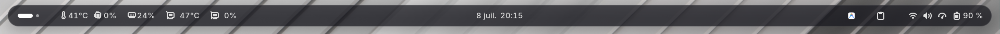

# SpaceBar

[](https://extensions.gnome.org/)

**SpaceBar** est une extension pour GNOME Shell qui permet d'améliorer le design de la barre supérieure (topBar) en lui donnant une apparence flottante, transparente et aux bords arrondis (*glassmorphism*).




---

## 🛠️ Installation

Pour installer l'extension simplement après avoir téléchargé et extrait l'archive ZIP :

1. Ouvrez un terminal dans le dossier extrait.
2. Exécutez le script d'installation :
   ```bash
   chmod +x install.sh
   ./install.sh
   ```
3. **Redémarrez GNOME Shell** pour appliquer les changements :
   - **Sous Wayland** : Déconnectez-vous de votre session puis reconnectez-vous.
   - **Sous X11** : Appuyez sur `Alt + F2`, saisissez `r`, puis appuyez sur `Entrée`.

---

## ⚙️ Configuration

Une fois activée, le design flottant et transparent s'applique automatiquement. Pour personnaliser le niveau de transparence, la couleur de la bordure ou les marges, vous pouvez éditer directement le fichier `stylesheet.css` inclus dans le dossier de l'extension.
